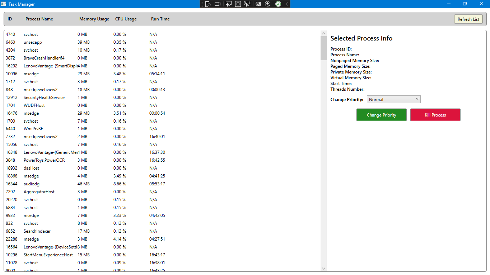

# **WPF Task Manager**  
A **lightweight** and **modern** Task Manager built with **WPF (Windows Presentation Foundation)** using the **MVVM (Model-View-ViewModel) architecture**. It utilizes the `System.Diagnostics.Process` class to display and manage system processes efficiently.  

 

## **🛠 Features**
✅ **List all running processes** with real-time data.  
✅ **Detailed process information** (Memory, Threads, Modules, etc.).  
✅ **Perform actions** on processes:  
   - Kill a process  
   - Change process priority  
✅ **Automatic & Manual Refresh**  
✅ **Persistent Process Monitoring**  
✅ **MVVM Architecture** (separating UI and logic for better maintainability).  

---

## **📂 Folder Structure**
```
project/
├── TaskManager
│   ├── Models/          # Process data models
│   ├── ViewModels/      # Handles UI logic
│   ├── Views/           # WPF UI components
│   ├── Services/        # Handles process management
│   ├── Helpers/         # Utility functions (e.g., RelayCommand)
│   ├── App.xaml         # Application entry point
│   ├── MainWindow.xaml  # Main UI layout
│   ├── TaskManager.csproj
│   ├── Properties/      # App settings & resources
├── TaskManager.sln      # Solution file
├── README.md            # Documentation
```
✅ **Follows MVVM architecture** for clean separation of concerns.  

---

## **🚀 Installation & Setup**
### **1️⃣ Prerequisites**
- Windows **10/11**  
- .NET **Core 6+** or **.NET Framework 4.7+**  
- Visual Studio **2019/2022** (or any C# IDE that supports WPF)  

### **2️⃣ Clone the Repository**
```sh
git clone https://github.com/BlackShort/wpf-task-manager.git
cd wpf-task-manager
```

### **3️⃣ Open in Visual Studio**
1. Open `TaskManager.sln` in **Visual Studio**.  
2. Build the project (`Ctrl + Shift + B`).  
3. Run (`F5`).  

---

## **⚙️ How It Works**
### **🔹 Process List**
- The app **automatically fetches** and displays all running processes.  
- Supports **manual refresh** and **automatic updates** (without UI flickering).  

### **🔹 Process Details**
- Click on a process to view:  
  ✅ **Process ID (PID)**  
  ✅ **Memory usage**  
  ✅ **Threads & Modules**  

### **🔹 Process Actions**
- 🛑 **Kill Process**: Instantly terminate a selected process.  
- 📊 **Change Priority**: Adjust process priority levels.  
- 🔄 **Restart Process**: Ensures continuity after crashes.  

---

## **💡 Future Improvements**
✅ **Search & Filter processes**  
✅ **CPU & Disk usage monitoring**  
✅ **Graphical performance insights**  

---

## **📜 License**
This project is **open-source** under the **MIT License**. Feel free to contribute and improve it!  

---

## **📞 Contact**
For feedback or contributions, reach out:  
📧 **Email:** Priyanshuk.7374@gmail.com  
🔗 **GitHub:** [BlackShort/wpf-task-manager](https://github.com/BlackShort/wpf-task-manager.git)  
